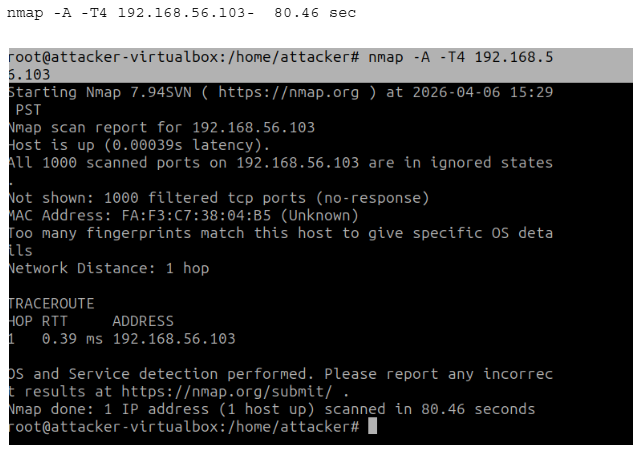
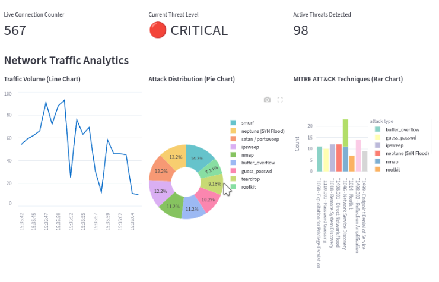
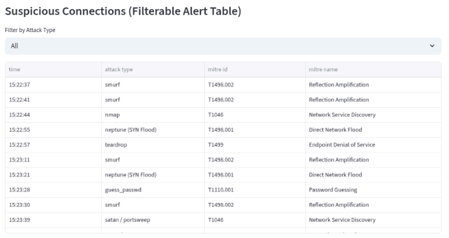

# Machine Learning-Based Network Intrusion Detection System (NIDS)

## Project Overview
This project is an AI-powered "digital security guard" that monitors network traffic and detects cyberattacks in real-time. It uses a dual-model machine learning approach (Random Forest and Isolation Forest) to catch known threats and flag zero-day anomalies, reducing "alert fatigue" for security analysts. 

## Dataset
**A small sample dataset (`sample_dataset.csv`) is included in the `/data` folder for quick testing and evaluation.** 

Due to GitHub size limits, the full dataset is not uploaded to this repository. We utilized the NSL-KDD / CIC-IDS2018 dataset for the full training of the machine learning models in this project. 
You can download the full dataset here: [https://www.kaggle.com/datasets/kiranmahesh/nslkdd]

## Setup Instructions
To run this project locally, you need Python installed on your machine. 

1. **Clone the repository:**
   `git clone https://github.com/your-username/group3-nids-project.git`
   `cd group3-nids-project`

2. **Install all dependencies:**
   `pip install -r requirements.txt`

## How to Run the Live Demo
To replicate our live attack simulation and view the real-time dashboard:

1. **Start the Dashboard:**
   Navigate to the `/src` folder and run the Streamlit application:
   `streamlit run dashboard.py`
   
2. **Setup the Virtual Environment:**
   Ensure you have a VirtualBox lab configured with a "Host-only" network to keep the attack traffic safely isolated. You will need an Attacker VM and a Target VM on the `192.168.56.x` subnet.

3. **Launch the Attack Simulation:**
   From the Attacker VM, run the following `nmap` scans against the Target VM to trigger the NIDS alerts:
      * Stealth SYN Scan: nmap -sS 192.168.56.103
      * Service Detection: nmap -sV 192.168.56.103
      * Aggressive Scan: nmap -A -T4 192.168.56.103

## System Screenshots

### 1. Live Attack Detection (Nmap Scan)
*The attacker launching a high-intensity scan from the terminal.*

### 2. Streamlit Real-Time Dashboard
*The system instantly catching the attack, flashing a "CRITICAL" warning, and categorizing the threat using the MITRE ATT&CK framework.*

